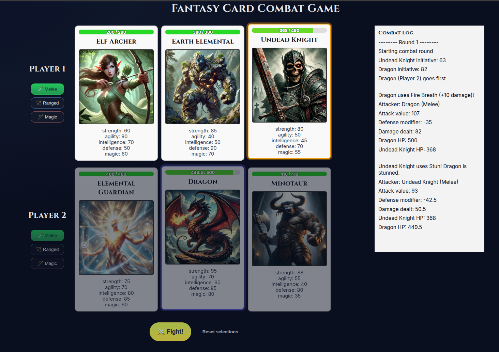

# Fantasy Combat Card Game

Welcome to the Fantasy Combat Card Game, a strategic two-player game where each player controls a hand of fantasy creatures with unique stats. Players engage in combat rounds, choosing between different combat styles like melee, ranged, or magic, and battle until one player runs out of cards.

## Table of Contents
* [Features](#features)
* [Game Rules / How To Play](#game-rules--how-to-play)
* [Getting Started](#getting-started)
* [Technologies Used](#technologies-used)
* [License](#license)
* [Acknowledgements](#acknowledgements)

## Features
* **Card-based Combat**: Each player controls a hand of fantasy creatures.
* **Combat Choices**: Players can choose between melee, ranged, or magic for each attack.
* **Strategic Combat**: Attack order is determined by a combination of agility, intelligence, and randomness.
* **Health-Based Elimination**: Creatures are removed from play when their health reaches zero.
* **Victory Condition**: A player wins when the other player runs out of cards.

* **Single-Player Mode (AI)**: Play against a simple AI that picks its best combat style.
* **Polished UI**: Themed combat buttons, tinted Fight CTA with glow, and player-specific card selection rings.
* **New Game Button**: Appears when the match ends to quickly reset and play again.

## Screenshot



## Game Rules / How To Play
1. **Deal**: Each player is dealt a hand of 3 unique creatures, each with its own stats (Strength, Agility, Intelligence, Defense, Magic).
1. **Card Selection**: Players select one creature from their hand for each round.
1. **Combat Style**: The player chooses between melee (strength), ranged (agility), or magic (magic) to attack the opponent.
1. **Initiative**: The attack order is determined by a combination of agility, intelligence, and a random factor.
1. **Health**: Each creature has a health pool. When a creature's health reaches zero, it is removed from the player's hand.
1. **Victory**: The game ends when one player runs out of creatures in their hand, and the other player is declared the winner.


## Getting Started
To get a local copy up and running, follow these simple steps:

### Prerequisites
Make sure you have Node.js installed. You can download it from here.
npm (Node Package Manager) comes with Node.js.

### Installation
Clone the repository:

```bash
git clone https://github.com/EdwardAThomson/fantasy-card-game.git
```

Navigate to the project directory:

```bash
cd fantasy-card-game
```

Install the necessary dependencies:

```bash
npm install
```

Start the development server:
```bash
npm start
```

The app should now be running at http://localhost:3000.

### Running Tests
Before running tests, make sure all dependencies are installed. If you have not already run `npm install` (or `npm ci`), do so first, then run:

```bash
npm test
```

## Technologies Used
* **React**: user interface.
* **JavaScript** (ES6+): Core logic for the game.

## License
This project is licensed under the MIT License - see the [LICENSE](LICENSE) file for details.

## Acknowledgements

I used ChatGPT (mostly 4o) to generate the code and art. There was still some human brain power used to provide the ideation and fit everything together. 